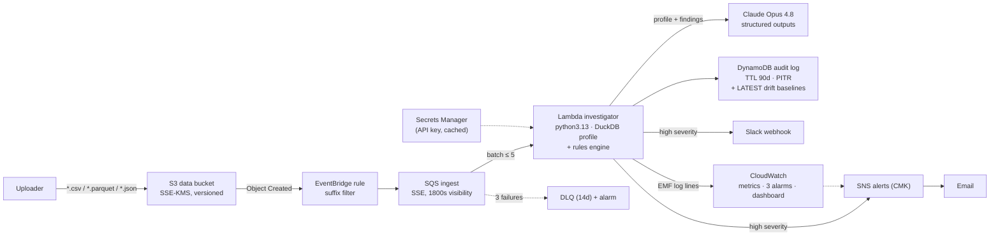

# Sentinel-AWS — Serverless Data Quality Investigator

Event-driven data quality pipeline: new files landing in S3 are profiled with DuckDB inside Lambda, checked by a deterministic rules engine, then analyzed by Claude Opus 4.8 for logical anomalies and human-readable root-cause explanations. Results land in a DynamoDB audit log; high-severity findings alert via Slack and email.

> 🚧 Under construction — built in phases, see [Phases.md](Phases.md). Design: [implementation_plan.md](implementation_plan.md). Operations: [RUNBOOK.md](RUNBOOK.md).
>
> **Standing it up from zero?** Follow [GETTING_STARTED.md](GETTING_STARTED.md) — ordered checklist from empty AWS account to demonstrated failure drills, with per-stage costs.

## Architecture



Idempotency: audit key is `s3://bucket/key#etag` with conditional writes — duplicate deliveries are free no-ops and never re-bill the LLM. LLM failures degrade to deterministic fallback scores (`llm_status=failed`, alarmed), never the DLQ.

## Status

- [x] Phase 0 — Setup (repo, tooling, CI)
- [x] Phase 1 — Core pipeline (DuckDB profiler + rules engine)
- [x] Phase 2 — AI layer (Claude structured outputs) — live smoke pending API key (`pytest -m live`)
- [x] Phase 3 — Eval harness — full-corpus rules baseline committed ([macro F1 0.67, 0% clean FPs](eval/results_rules_baseline.md)); LLM arms pending API key
- [ ] Phase 4 — Infrastructure (Terraform) — **all code written and validated offline**: `terraform validate` clean (Terraform 1.15.7, AWS provider v6.53, providers lock-pinned for windows+linux), Lambda layer builds at 27 MB zipped / 78 MB unzipped with dev==prod DuckDB parity enforced; `terraform apply` pending an AWS account ([GETTING_STARTED.md](GETTING_STARTED.md) stages 2–4)
- [ ] Phase 5 — Hardening & observability — **offline half done**: OIDC CI roles (plan-on-PR read-only, apply human-gated), actions SHA-pinned, trivy IaC scan clean after fixing all 6 findings (CMK for S3+SNS, SSE-SQS, versioning+lifecycle, PITR, bounded log retention); failure-path drills + alarm/dashboard evidence need the deployed stack
- [ ] Phase 6 — Full eval & ship — needs API key (~$20–35 Batches run) + deployed stack (demo GIF, p99)

## Estimated monthly cost @ 1,000 files/day

Assumptions: 30K files/mo, ~5 MB each, us-east-1 prices (July 2026), `LLM_SKIP_ON_CLEAN=true` with a 10% dirty rate → 3K LLM calls/mo.

| Component | $/month | Driver |
|---|---:|---|
| Lambda (1024 MB) | ~2.60 | ~3 s clean profile, ~25 s when the LLM runs |
| S3 | ~3.60 | 150 GB-mo storage (uploader retention) + requests |
| CloudWatch | ~2.70 | 8 EMF metrics ($0.30 ea) + 3 alarms; logs inside free tier |
| KMS (1 CMK) | ~1.00 | bucket-key on → API calls ≈ nil |
| Secrets Manager | ~0.80 | 2 secrets, values cached per container |
| DynamoDB (on-demand) | ~0.12 | ~180K WRU + 60K RRU |
| SQS / EventBridge / SNS / Budgets | ~0.00 | free tiers / free service events |
| **Infrastructure total** | **≈ $11** | |
| Claude Opus 4.8 (3K analyses) | ~150 *(estimate)* | token counts pending measured eval; levers: `claude-sonnet-5` ≈ $90, 1% dirty rate ≈ $15 |

## Development

```sh
conda create -n aws python=3.13   # once; matches the Lambda runtime
conda activate aws
pip install -r requirements-dev.txt
ruff check .
pytest -m "not live"
```

Secrets: copy [.env.example](.env.example) and set `ANTHROPIC_API_KEY` in your shell.
Live tests (real API calls, a few cents): `pytest -m live -s`.

Eval harness (rules-only arm needs no key):

```sh
python eval/generate_dirty_data.py --out eval/corpus
python eval/run_eval.py --manifest eval/corpus/manifest.json --arms rules_only
# with ANTHROPIC_API_KEY set (smoke ≈ <$5):
python eval/run_eval.py --manifest eval/corpus/manifest.json --out eval/results.md
```
